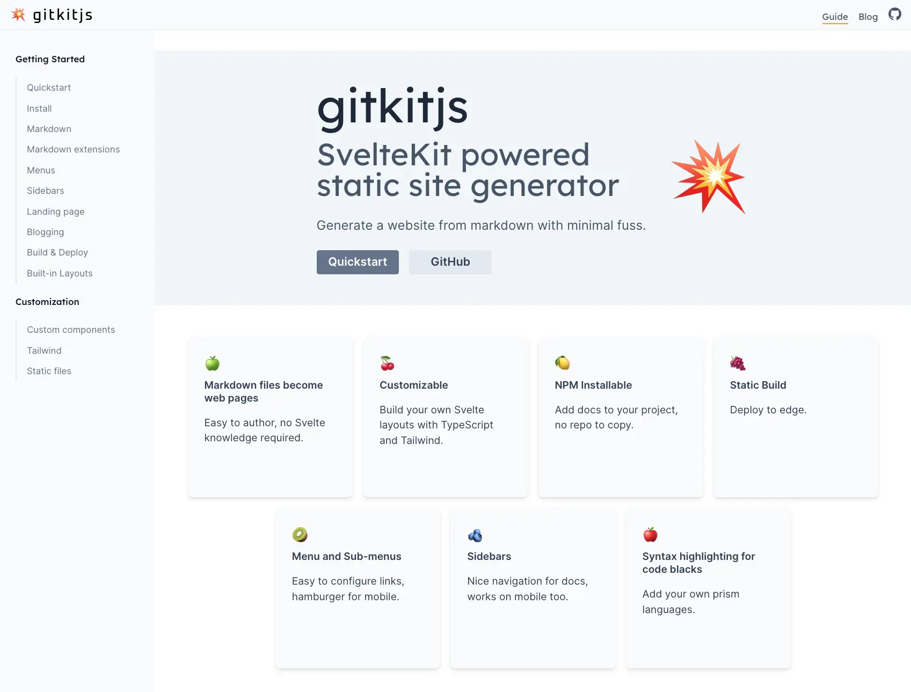

# Hello gitkitjs

I am pleased to announce [gitkitjs](https://github.com/gitkitjs/gitkitjs), the npm-installable SvelteKit toolchain for building websites from markdown.

Gitkitjs is a friendly continuation of the [zaui](https://zaui.zeroasic.com) project, which powers [zeroasic.com/emulation](https://www.zeroasic.com/emulation).

### Quickstart

1. `pnpm install -D @gitkitjs/gitkitjs`
2. `pnpm gitkitjs dev`
3. Type `o` to open your browser.

If you don't already have a `content` directory you will see the [gitkitjs guide](https://gitkitjs.dev/guide/quickstart) -- rendered by gitkitjs, of course.

### This library provides

- A preconfigured [SvelteKit](https://kit.svelte.dev/docs/introduction) app with a [Vite](https://vitejs.dev/) dev server and build.
- [Tailwind CSS](https://tailwindcss.com/docs/installation), and the [Tailwind typography](https://tailwindcss.com/docs/typography-plugin) plugin.
- Markdown rendering based on [Markdoc](https://github.com/markdoc/markdoc).
- A set of built-in website navigation and page components.
- Static publishing using the SvelteKit [static adapter](https://kit.svelte.dev/docs/adapter-static).
- TypeScript

Thank you to Zero ASIC and all the contributors in those communities. 🙏

To find out more, visit the [gitkitjs](https://github.com/gitkitjs/gitkitjs) repo on GitHub or check out the [guide](https://gitkitjs.dev/guide/quickstart).