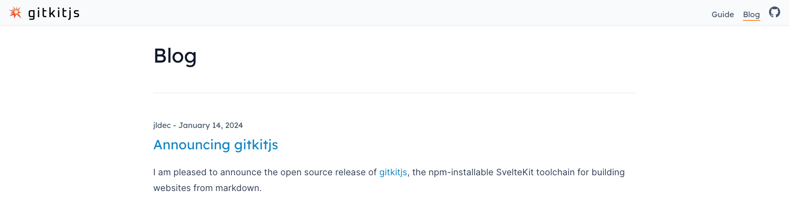
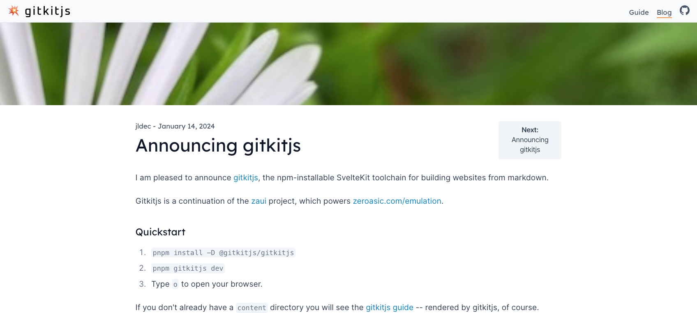

# Blogging

Blog posts are authored in the content/blog directory. Each post should have a title and `yyyy-mm-dd` date in the frontmatter. Splash image, author, and excerpt are optional.

```yaml
---
title: Hello gitkitjs
author: jldec
splash:
  image: images/sunrise-deansgrange.webp
date: 2024-01-14
excerpt: |
  I am pleased to announce the open source release of [gitkitjs](https://github.com/gitkitjs/gitkitjs), the npm-installable SvelteKit toolchain for building websites from markdown.
---
```



